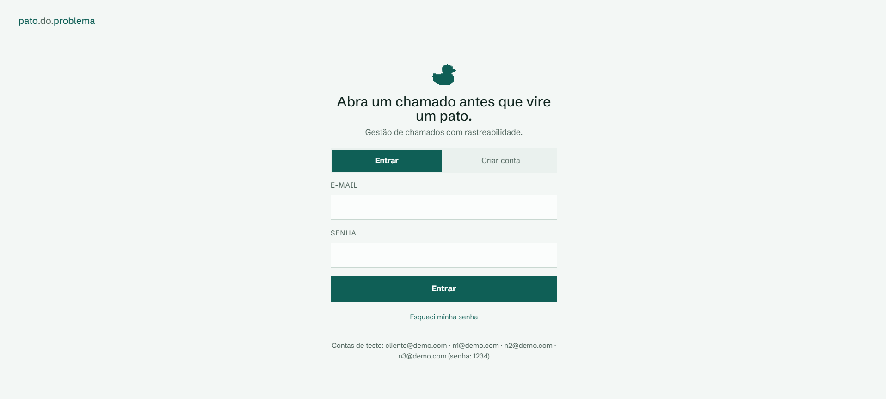
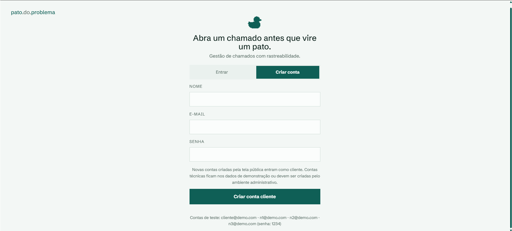
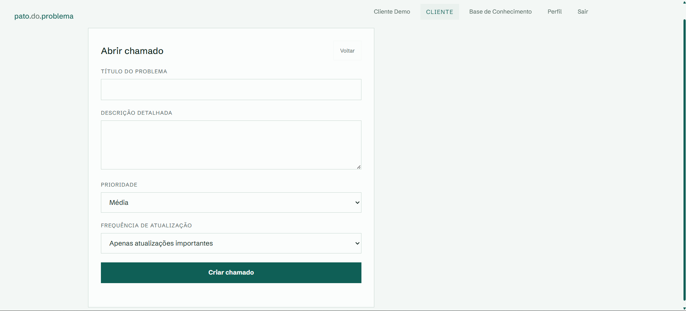
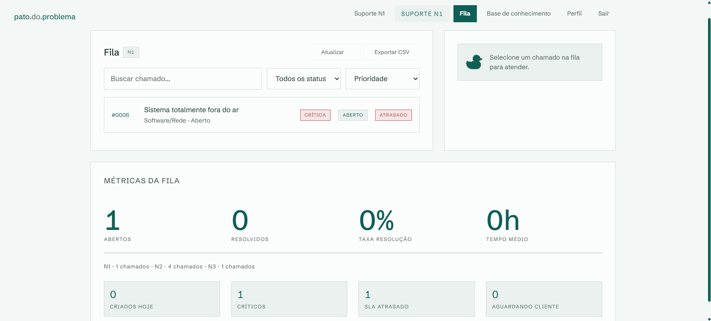
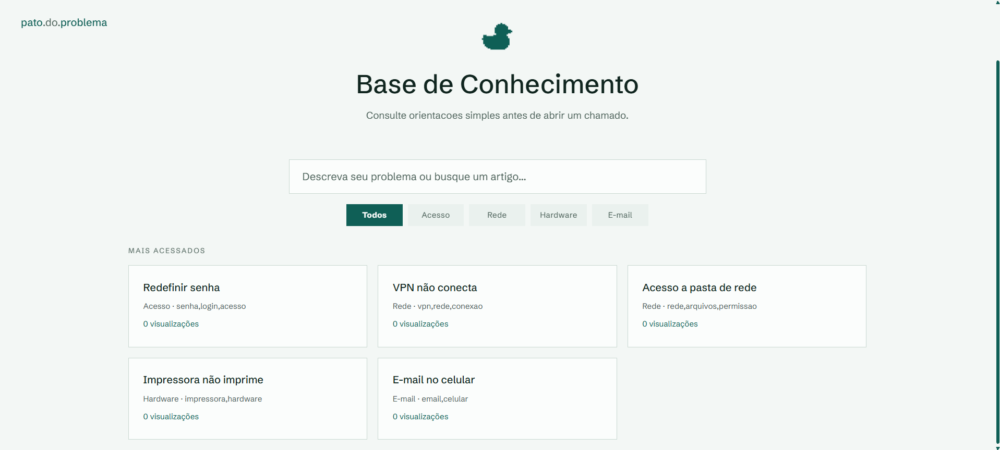
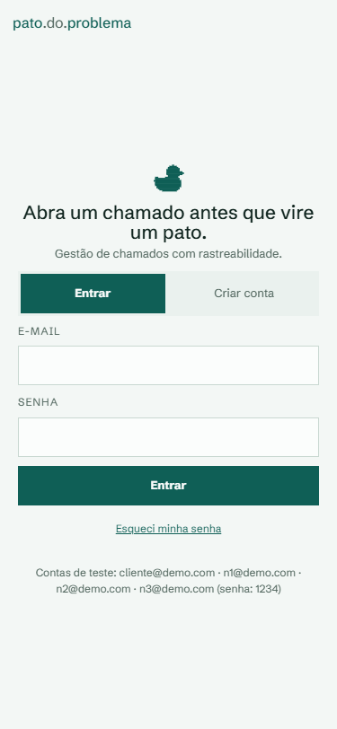
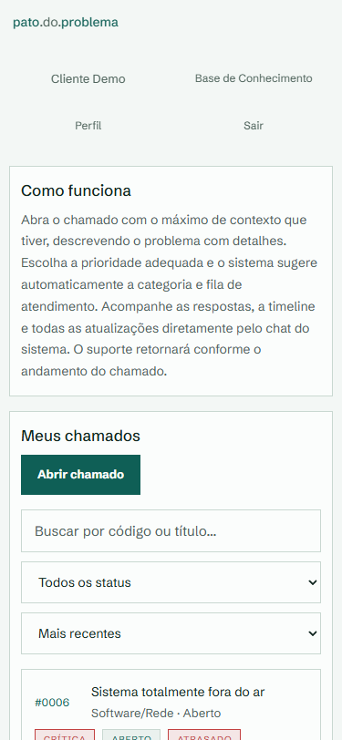
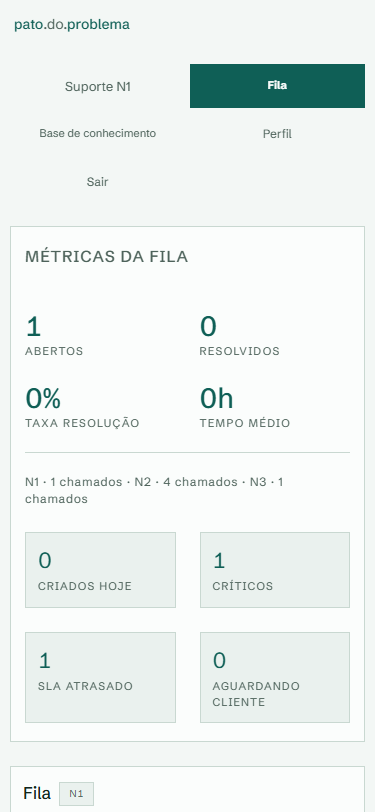
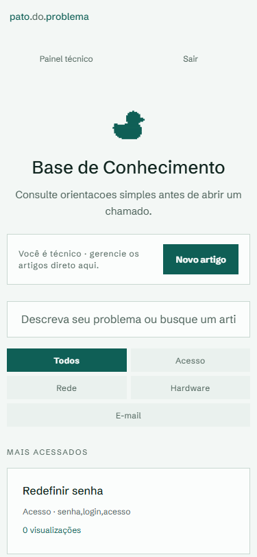

# pato.do.problema

Internal support ticket system, built as a portfolio project.

The client opens a ticket, follows it through chat, and support works the queue by level (N1/N2/N3), with history, attachments, internal notes, and a knowledge base.

Not SaaS. A functional demo with an organized backend, framework-free frontend, and flow tests.


## Demo

**[https://pato-do-problema-helpdesk.onrender.com](https://pato-do-problema-helpdesk.onrender.com)**

Test accounts in the [Demo accounts](#demo-accounts) section. First access may take 30s (Render's free plan hibernates the service when inactive).

## Screenshots

### Desktop

| Screen | Screenshot |
|--------|-----------|
| Login |  |
| Create account |  |
| Open ticket | ! |
| Client area |  |
| N1 panel |  |
| Knowledge base |  |

Other desktop screenshots available in the screenshots folder: N2, N3.

### Mobile

| Screen | Screenshot |
|--------|-----------|
| Login |  |
| Client area |  |
| Tech panel |  |
| Knowledge base |  |

All screenshots are in the screenshots folder.

## What it does

- Client opens a ticket with title, description, and priority
- Ticket enters the N1 queue, can be escalated to N2/N3
- Conversation between client and support with timeline
- Internal notes between technicians
- Attachments per ticket
- Knowledge base
- Metrics per queue (open, resolved, SLA, average time)

## Basic flow

1. The client creates an account or logs in with the demo account.
2. They open a ticket with title, description, priority, and update frequency.
3. The ticket enters the N1 queue with category and ETA defined automatically.
4. The technician of the corresponding queue follows the ticket through the panel.
5. Client and support exchange messages, attachments, and status updates.
6. If necessary, the ticket can be escalated from N1 to N2 or from N2 to N3.
7. At the end, the ticket is resolved or closed, keeping the history in the timeline.

## Design decisions

- Frontend in vanilla JS because the project is small and doesn't justify a framework.
- Backend without service/repository layer. Direct SQL with helpers, separated by route.
- The duck appears on login and in empty states. Visual identity, not a feature.

## Stack

- **Backend:** FastAPI, Pydantic and direct SQL.
- **Database:** Local SQLite by default, with PostgreSQL support via DATABASE_URL.
- **Authentication:** JWT with python-jose and passwords with passlib/bcrypt.
- **Frontend:** HTML, CSS and JavaScript without framework.
- **Optional AI:** escalation summary, response suggestion and language adaptation via Anthropic API (requires ANTHROPIC_API_KEY).
- **Tests:** pytest and FastAPI's TestClient.
- **Deploy:** Docker and render.yaml.

## Structure

```
backend/
  main.py              # API initialization, CORS, routes and static frontend
  config.py            # environment configuration
  database.py          # connection, schema and SQL helpers
  schemas.py           # API input models
  helpers.py           # validations, current user and common ticket functions
  ai.py                # summary, response suggestion and language adaptation (Anthropic API)
  notify.py            # email sending when SMTP is configured
  routes_auth.py       # registration, login and profile
  routes_tickets.py    # tickets, messages, queue, status and escalation
  routes_attachments.py # upload, listing and download of attachments
  routes_metrics.py    # metrics and CSV export
  routes_password.py   # forgot password and reset
  routes_kb.py         # knowledge base
  seed.py              # demo accounts and articles
  tests/               # flow and permission tests
frontend/
  index.html           # login and client registration
  cliente.html         # client area
  painel.html          # tech panel
  faq.html             # knowledge base
  redefinir.html       # password reset
  api.js               # session, HTTP calls and UI utilities
  pato.js              # duck brand/illustrations
  style.css            # shared styles
screenshots/           # real application screenshots for README
Dockerfile
render.yaml
```

## How to run locally

```bash
cd backend
python -m venv .venv
.venv\Scripts\Activate.ps1  # Windows PowerShell
# source .venv/bin/activate  # Linux/macOS
pip install -r requirements.txt
uvicorn main:app --reload
```

Then access:

```
http://localhost:8000
```

### Running with PyCharm

The project includes shared configurations in `.run/`:

- **Pato Backend**: starts FastAPI with `uvicorn main:app --reload`, using `backend/` as the working directory.
- **Pato Tests**: runs the tests in `backend/tests`.

On first use, select the Python interpreter from the virtual environment created at `backend/.venv`. If you prefer to use the Run button directly on the file, run `backend/main.py`; it starts the server at http://127.0.0.1:8000.

## Environment variables

Copy `backend/.env.example` to `backend/.env`.

| variable | usage |
|----------|-------|
| APP_ENV | development or production |
| JWT_SECRET | secret for signing JWT |
| TOKEN_HOURS | token duration in hours |
| ALLOWED_ORIGINS | CORS origins, comma-separated |
| ANTHROPIC_API_KEY | Anthropic key for AI (see AI Integration) |
| ANTHROPIC_MODEL | API model (default: claude-sonnet-4-20250514) |
| DATABASE_URL | PostgreSQL (without it, uses SQLite) |
| SMTP_* | email sending for password reset |
| SEED_DEMO | creates demo accounts and articles in empty database |

In production, requires JWT_SECRET and does not accept ALLOWED_ORIGINS=*.

## Demo accounts

| user | password | profile |
|------|----------|---------|
| cliente@demo.com | 1234 | client |
| n1@demo.com | 1234 | N1 support |
| n2@demo.com | 1234 | N2 support |
| n3@demo.com | 1234 | N3 support |

Short passwords only in demo. New accounts require at least 8 characters.

## How to run the tests

```bash
cd backend
pip install -r requirements.txt
pytest
```

Covers: auth, ticket opening, permissions, queue, messages, attachments, password reset, knowledge base and CSV export.

## AI Integration (optional)

Works without API key. With ANTHROPIC_API_KEY configured, unlocks three extras in the tech panel:

- **Escalation summary**: generates a history summary when escalating N1 > N2 > N3
- **Response suggestion**: suggests a client response based on history
- **Adapt language**: rewrites a technical response in plain language

Without the key, these buttons return an error. To configure:

```
ANTHROPIC_API_KEY=sk-ant-...
```

## Limitations

- No admin panel (technicians come from seed)
- Attachments in base64 in the database (does not scale)
- No migrations (schema created on initialization)
- Without SMTP, password reset returns dev_token in dev
- Permissions cover the main flow, nothing more

## To-Do

- Admin panel to create technicians
- Move attachments to external storage
- Audit logs
- Better search in knowledge base
