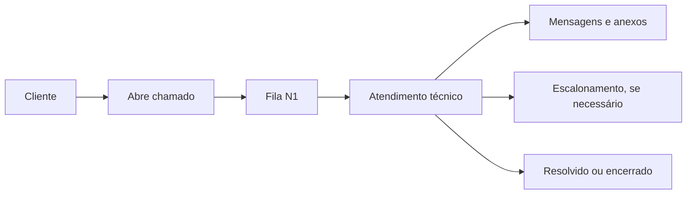

# pato.do.problema

Sistema de chamados de suporte interno, feito como projeto de portfólio.

O cliente abre chamado, acompanha pelo chat e o suporte trabalha a fila por nível (N1/N2/N3), com histórico, anexos, notas internas e base de conhecimento.

Não é SaaS. É uma demo funcional com backend organizado, frontend sem framework e testes de fluxo.


## Demo

**[https://pato-do-problema-helpdesk.onrender.com](https://pato-do-problema-helpdesk.onrender.com)**

Contas de teste na secao [Contas demo](#contas-demo). O primeiro acesso pode demorar 30s (plano gratuito do Render hiberna o servico quando inativo).

## Screenshots

### Desktop

| Tela | Screenshot |
|------|-----------|
| Login |  |
| Criar conta |  |
| Abrir chamado |  |
| Area do cliente |  |
| Painel N1 |  |
| Base de conhecimento |  |

Outros prints desktop disponiveis na [pasta screenshots](screenshots/): N2, N3.

### Mobile

| Tela | Screenshot |
|------|-----------|
| Login |  |
| Area do cliente |  |
| Painel tecnico |  |
| Base de conhecimento |  |

Todos os prints estao na [pasta screenshots](screenshots/).

## O que faz

- Cliente abre chamado com titulo, descricao e prioridade
- Chamado entra na fila N1, pode ser escalado para N2/N3
- Conversa entre cliente e suporte com timeline
- Notas internas entre tecnicos
- Anexos por chamado
- Base de conhecimento
- Metricas por fila (abertos, resolvidos, SLA, tempo medio)

## Fluxo básico

1. O cliente cria uma conta ou entra com a conta demo.
2. Ele abre um chamado com título, descrição, prioridade e frequência de atualização.
3. O chamado entra na fila N1 com categoria e ETA definidos automaticamente.
4. O técnico da fila correspondente acompanha o chamado pelo painel.
5. Cliente e suporte trocam mensagens, anexos e atualizações de status.
6. Se necessário, o chamado pode ser escalado de N1 para N2 ou de N2 para N3.
7. Ao final, o chamado é resolvido ou encerrado, mantendo o histórico na timeline.



## Decisões de projeto

- Frontend em vanilla JS porque o projeto é pequeno e não justifica framework.
- Backend sem camada service/repository. SQL direto com helpers, separado por rota.
- O pato aparece no login e em estados vazios. Identidade visual, não feature.

## Stack

- Backend: FastAPI, Pydantic e SQL direto.
- Banco: SQLite local por padrão, com suporte a PostgreSQL via `DATABASE_URL`.
- Autenticação: JWT com `python-jose` e senhas com `passlib/bcrypt`.
- Frontend: HTML, CSS e JavaScript sem framework.
- IA opcional: resumo de escalonamento, sugestão de resposta e adaptação de linguagem via API da Anthropic (requer `ANTHROPIC_API_KEY`).
- Testes: pytest e TestClient do FastAPI.
- Deploy: Docker e `render.yaml`.

## Estrutura

```text
backend/
  main.py                # inicialização da API, CORS, rotas e frontend estático
  config.py              # configuração por ambiente
  database.py            # conexão, schema e helpers SQL
  schemas.py             # modelos de entrada da API
  helpers.py             # validações, usuário atual e funções comuns de chamado
  ai.py                  # resumo, sugestão de resposta e adaptação de linguagem (Anthropic API)
  notify.py              # envio de e-mail quando SMTP estiver configurado
  routes_auth.py         # cadastro, login e perfil
  routes_tickets.py      # chamados, mensagens, fila, status e escalonamento
  routes_attachments.py  # upload, listagem e download de anexos
  routes_metrics.py      # métricas e exportação CSV
  routes_password.py     # esqueci senha e redefinição
  routes_kb.py           # base de conhecimento
  seed.py                # contas e artigos demo
  tests/                 # testes de fluxo e permissões
frontend/
  index.html             # login e cadastro de cliente
  cliente.html           # área do cliente
  painel.html            # painel técnico
  faq.html               # base de conhecimento
  redefinir.html         # redefinição de senha
  api.js                 # sessão, chamadas HTTP e utilidades de UI
  pato.js                # marca/ilustrações do pato
  style.css              # estilos compartilhados
screenshots/             # prints reais da aplicação para o README
Dockerfile
render.yaml
```

## Como rodar localmente

```bash
cd backend
python -m venv .venv
.venv\Scripts\Activate.ps1  # Windows PowerShell
# source .venv/bin/activate  # Linux/macOS
pip install -r requirements.txt
uvicorn main:app --reload
```

Depois acesse:

```text
http://localhost:8000
```

### Rodando pelo PyCharm

O projeto inclui configuracoes compartilhadas em `.run/`:

- `Pato Backend`: inicia o FastAPI com `uvicorn main:app --reload`, usando `backend/` como diretório de trabalho.
- `Pato Tests`: executa os testes em `backend/tests`.

No primeiro uso, selecione o interpretador Python do ambiente virtual criado em `backend/.venv`. Se preferir usar o botão Run direto no arquivo, execute `backend/main.py`; ele inicia o servidor em `http://127.0.0.1:8000`.

## Variáveis de ambiente

Copie `backend/.env.example` para `backend/.env`.

| variavel | uso |
|---|---|
| `APP_ENV` | `development` ou `production` |
| `JWT_SECRET` | segredo para assinar JWT |
| `TOKEN_HOURS` | duracao do token em horas |
| `ALLOWED_ORIGINS` | origens CORS, separadas por virgula |
| `ANTHROPIC_API_KEY` | chave da Anthropic para IA (ver [Integracao com IA](#integração-com-ia-opcional)) |
| `ANTHROPIC_MODEL` | modelo da API (padrao: `claude-sonnet-4-20250514`) |
| `DATABASE_URL` | PostgreSQL (sem ela, usa SQLite) |
| `SMTP_*` | envio de e-mail para reset de senha |
| `SEED_DEMO` | cria contas e artigos demo no banco vazio |

Em producao, exige `JWT_SECRET` e nao aceita `ALLOWED_ORIGINS=*`.

## Contas demo

| usuário | senha | perfil |
|---|---|---|
| `cliente@demo.com` | `1234` | cliente |
| `n1@demo.com` | `1234` | suporte N1 |
| `n2@demo.com` | `1234` | suporte N2 |
| `n3@demo.com` | `1234` | suporte N3 |

Senhas curtas so na demo. Contas novas exigem no minimo 8 caracteres.

## Como rodar os testes

```bash
cd backend
pip install -r requirements.txt
pytest
```

Cobre: auth, abertura de chamado, permissoes, fila, mensagens, anexos, reset de senha, base de conhecimento e export CSV.

## Integração com IA (opcional)

Funciona sem chave de API. Com `ANTHROPIC_API_KEY` configurada, libera tres extras no painel tecnico:

- **Resumo de escalonamento**: gera resumo do historico ao escalar N1 > N2 > N3
- **Sugestao de resposta**: sugere resposta ao cliente baseada no historico
- **Adaptar linguagem**: reescreve resposta tecnica em linguagem simples

Sem a chave, esses botoes retornam erro. Para configurar:

```env
ANTHROPIC_API_KEY=sk-ant-...
```

## Limitações

- Sem painel admin (tecnicos vem do seed)
- Anexos em base64 no banco (não escala)
- Sem migrations (schema criado na inicializacao)
- Sem SMTP, reset de senha devolve `dev_token` em dev
- Permissões cobrem o fluxo principal, não mais que isso

## To-Do

- Painel admin para criar tecnicos
- Mover anexos para storage externo
- Logs de auditoria
- Busca melhor na base de conhecimento
